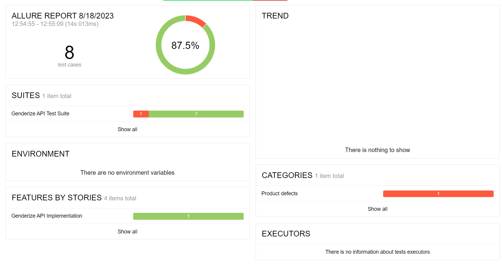

# Genderize api Test Automation Project

This repository contains a test automation for genderize api as a sample project that uses Rest Assured and TestNG for testing and gradle for building the project. 
Allure reporting has been used to serve the reports in the HTML format. 

## Project Structure

The project follows a structured layout to enhance maintainability and organization:

The test folder consists of pojo's,utils(RestHelper and TestConfig) and api tests. 
The resources package consists of expected results, properties files and api schema for validation. 
Testng.xml file is used to execute tests.

## Prerequisites-

Java, IDE (Any IDE - Intelli J, Eclipse etc.), Allure

## Project Setup and Test Execution -
1. Clone repository in your local.
2. Change test data added in the data driven tests, if needed.
3. Run the tests using TestNG by executing the testng.xml file.
4. Type in Command "allure serve" to see the reports in HTML format.  
Note - As allure reports use test listeners, please ensure that default reporters are enabled in the IDE run configuration.
Eg., IntelliJ  - testng.xml - Edit configuration >> Configuration >> Listeners tab>> Check box - "Use default reporters" should be enabled. 

## Allure report Overview - 
1. Epic and Stories view is depicted.Overall pass percentage and trend will be displayed.
2. Description, parameters, and request and response are recorded for each test. 
